# SSH Password Attack and Defense Lab

A Red Team vs Blue Team cybersecurity lab demonstrating how weak SSH credentials can be exploited and how defensive controls can reduce the risk of password-based attacks.

## Overview

This project demonstrates a controlled password attack against an intentionally vulnerable Linux system in an isolated VirtualBox environment.

The Red Team phase focuses on host discovery, SSH enumeration, credential testing, remote access, and demonstrating the impact of compromised credentials.

The Blue Team phase focuses on authentication monitoring, stronger password controls, Fail2Ban, and SSH hardening.

## Lab Environment

- Kali Linux — Attacker machine
- Metasploitable 2 — Target machine
- Oracle VirtualBox
- Host-only isolated network
- SSH service
- Nmap
- Medusa
- Fail2Ban

## Objectives

- Identify systems on the lab network
- Discover an exposed SSH service
- Enumerate the SSH version
- Perform a controlled password attack
- Demonstrate the impact of compromised credentials
- Review authentication activity
- Apply stronger password controls
- Configure Fail2Ban
- Harden the SSH service
- Document defensive lessons learned

---

# Red Team

## 1. Lab Environment

The lab was created using Kali Linux as the attacker machine and Metasploitable 2 as the intentionally vulnerable target.

Both virtual machines were used inside a controlled VirtualBox environment.

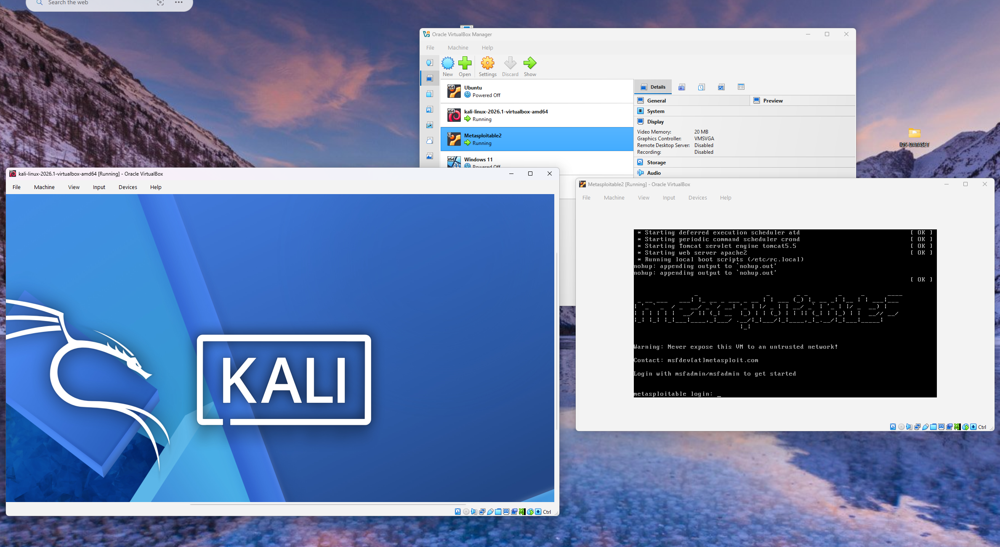

---

## 2. Kali Linux Network Configuration

The Kali Linux network interfaces were reviewed to identify the attacker's IP address and confirm connectivity to the isolated lab network.

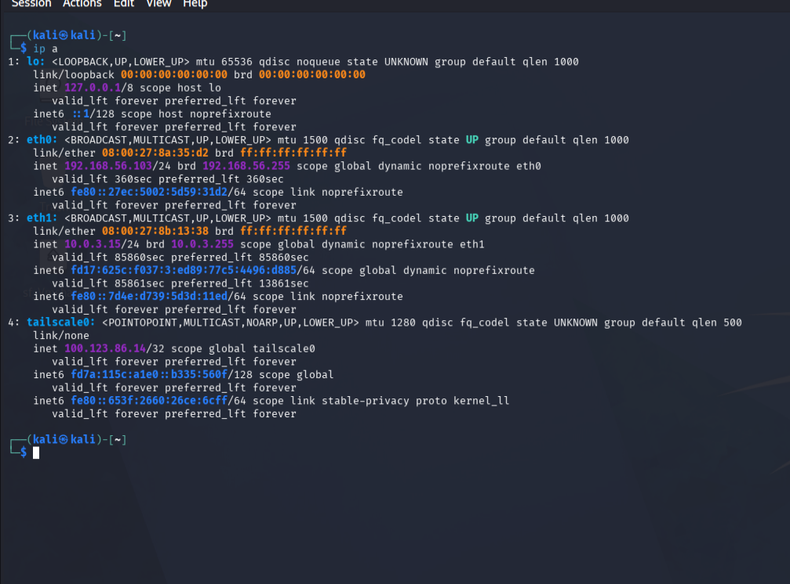

---

## 3. Network Discovery

Nmap was used to identify active systems on the `192.168.56.0/24` network.

```bash
sudo nmap -sn 192.168.56.0/24
```

The scan identified multiple active hosts, including the target system.

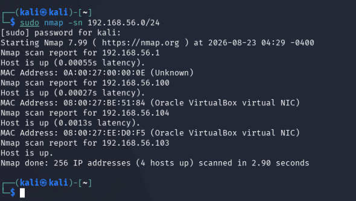

---

## 4. SSH Port Discovery

After identifying the target IP address, TCP port 22 was checked to determine whether SSH was accessible.

```bash
nmap -p 22 192.168.56.104
```

The scan confirmed that TCP port 22 was open.

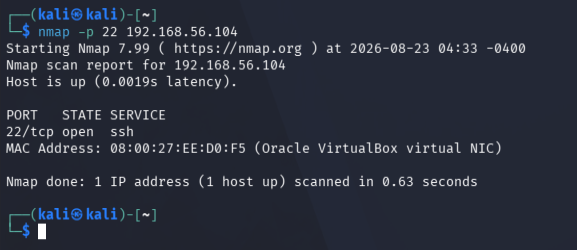

---

## 5. SSH Service Enumeration

Nmap service detection was used to identify the SSH implementation and version running on the target.

```bash
nmap -sV -p 22 192.168.56.104
```

The target was running:

```text
OpenSSH 4.7p1 Debian 8ubuntu1
```

This demonstrated why service enumeration is important before attempting further testing.

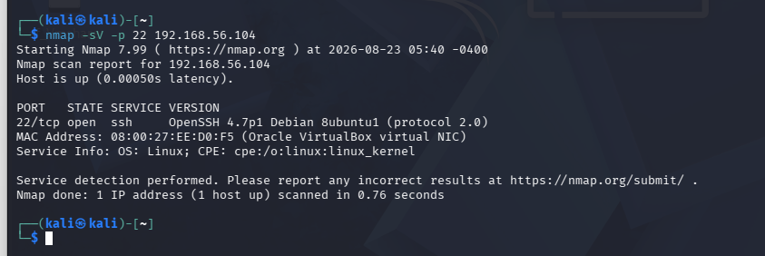

---

## 6. Password List Preparation

A small custom password list was created for the controlled attack.

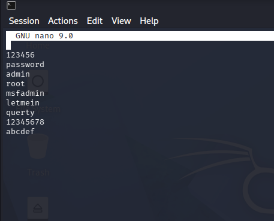

The Kali Linux `rockyou.txt` wordlist was also reviewed as an example of a commonly used password dictionary.

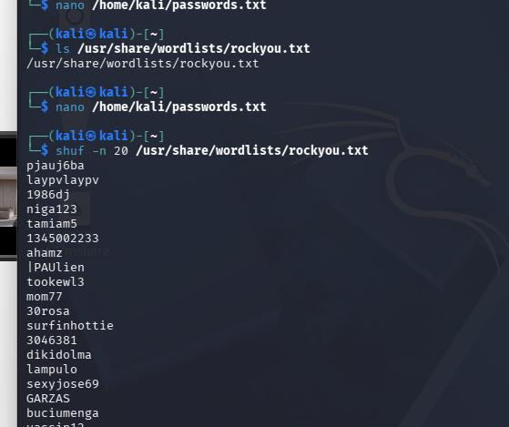

---

## 7. SSH Password Attack

Medusa was used to perform a controlled credential attack against the SSH service.

```bash
medusa -h 192.168.56.104 \
-U /home/kali/users.txt \
-P /home/kali/passwords.txt \
-M ssh -t 4
```

During the test, Medusa successfully identified valid credentials for the `msfadmin` account.

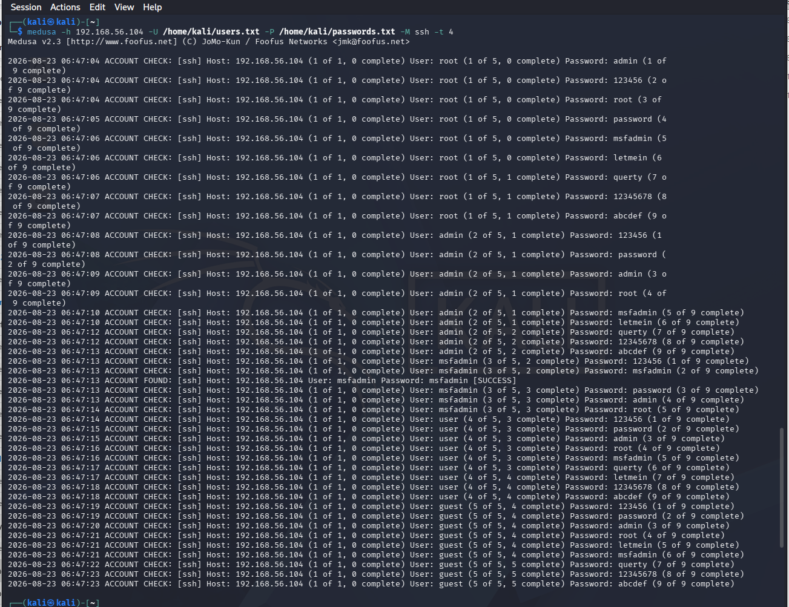

### Finding

Weak or predictable passwords can allow an attacker to obtain valid remote-access credentials.

---

## 8. Initial SSH Access

The recovered credentials were used to log in to the target through SSH.

After authentication, commands such as the following were used to verify access:

```bash
whoami
id
hostname
```

The session confirmed access as:

```text
msfadmin
```

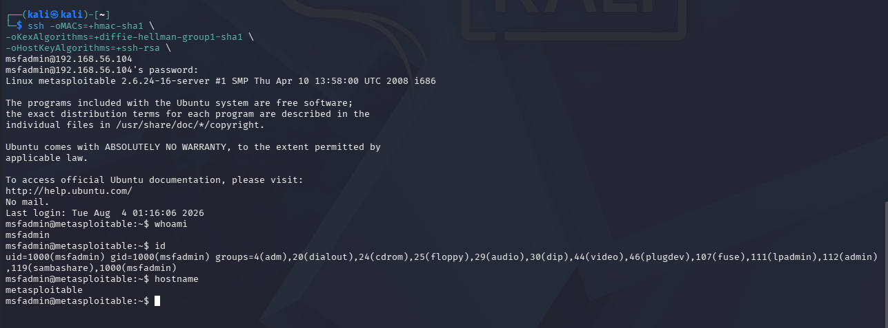

---

## 9. Post-Compromise Demonstration

The impact of obtaining a valid account was demonstrated by accessing system information.

An attempt to read `/etc/shadow` without elevated privileges was denied.

```bash
cat /etc/shadow
```

The same command was then executed using elevated privileges:

```bash
sudo cat /etc/shadow
```

This demonstrated how compromised credentials combined with excessive privileges can expose sensitive system information.

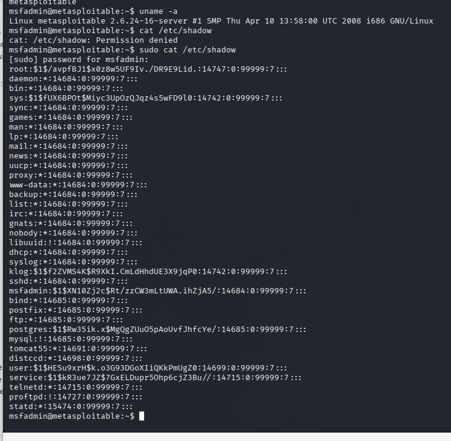

---

# Blue Team

## 10. Authentication Monitoring

Authentication activity was reviewed using the Linux authentication log.

```bash
tail -f /var/log/auth.log
```

The logs showed successful SSH authentication and other privileged activity.

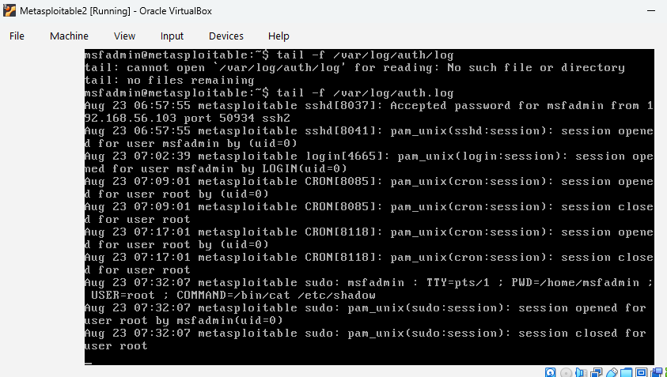

### Defensive Value

Authentication logs can help defenders identify:

- Successful SSH logins
- Failed authentication attempts
- Privilege escalation
- Suspicious account activity
- Repeated login attempts

---

## 11. Password Policy Controls

Password-quality controls were installed to strengthen account password requirements.

```bash
sudo apt-get install libpam-pwquality
```

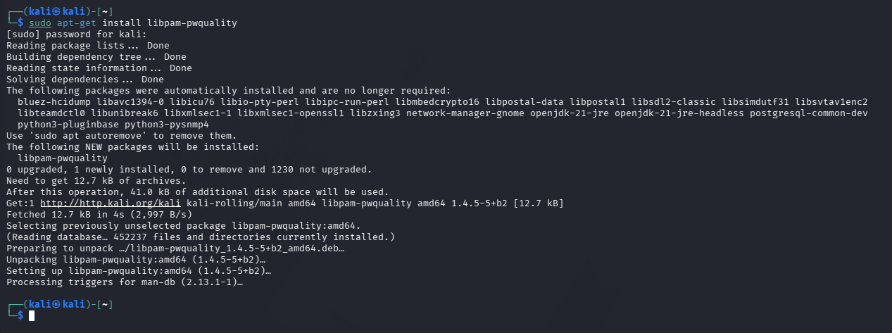

Password requirements were then configured.

Example settings included:

```text
minlen = 12
minclass = 3
maxrepeat = 2
dcredit = -1
ucredit = -1
lcredit = -1
ocredit = -1
```

These settings require stronger passwords containing multiple character classes.

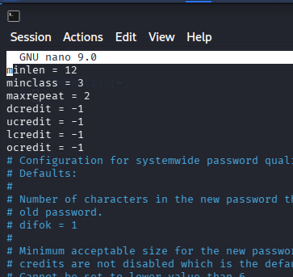

---

## 12. Fail2Ban Configuration

Fail2Ban was configured to monitor SSH authentication failures.

Example SSH jail configuration:

```ini
[sshd]
enabled = true
port = ssh
filter = sshd
logpath = /var/log/auth.log
maxretry = 3
bantime = 3600
findtime = 600
```

This configuration limits repeated authentication attempts by temporarily blocking systems that exceed the configured threshold.

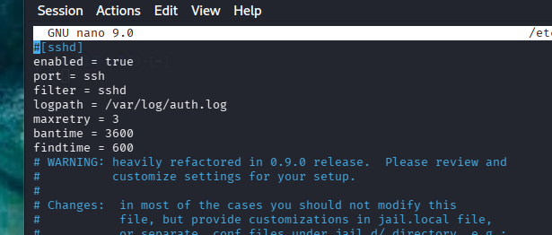

---

## 13. Fail2Ban Service Verification

The Fail2Ban service was restarted and its status verified.

```bash
sudo systemctl restart fail2ban
sudo systemctl status fail2ban
```

The service was shown as active and running.

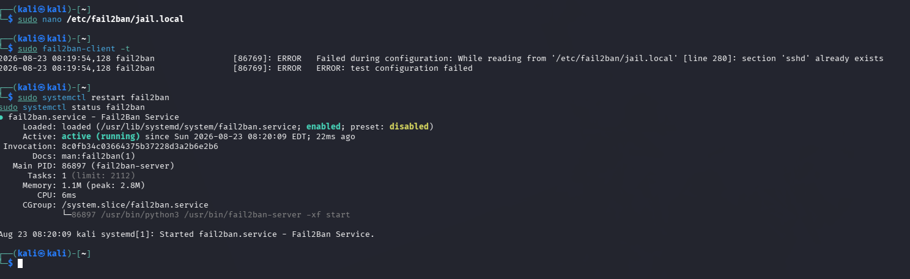

### Defensive Value

Fail2Ban helps reduce password-guessing attacks by temporarily blocking sources that repeatedly fail authentication.

---

## 14. SSH Hardening

Additional SSH security controls were configured in:

```text
/etc/ssh/sshd_config
```

The configuration included:

```text
PermitRootLogin no
MaxAuthTries 3
LoginGraceTime 60
PasswordAuthentication no
PubkeyAuthentication yes
```

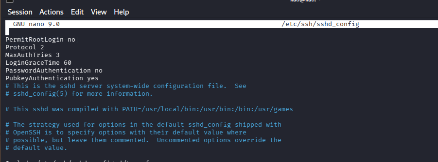

These settings reduce the attack surface by:

- Preventing direct root SSH login
- Limiting authentication attempts
- Reducing the login grace period
- Disabling password-based authentication
- Requiring SSH public-key authentication

---

# Results

The lab demonstrated that an exposed SSH service combined with weak credentials can allow an attacker to obtain remote access.

The Red Team phase successfully demonstrated:

- Network discovery
- SSH service enumeration
- Password testing
- Credential compromise
- SSH access
- Access to sensitive system information after privilege escalation

The Blue Team phase demonstrated several defensive controls:

- Authentication log monitoring
- Stronger password requirements
- Fail2Ban protection
- Reduced SSH authentication attempts
- Root login restriction
- SSH key-based authentication

---

# Lessons Learned

This lab demonstrated that password security cannot rely on a single defensive measure.

Important lessons included:

1. Weak passwords can undermine otherwise legitimate remote-access services.
2. Network and service enumeration provides attackers with valuable information.
3. Authentication logs are important for identifying suspicious login activity.
4. Strong password policies reduce the effectiveness of dictionary-based attacks.
5. Fail2Ban can reduce repeated login attempts.
6. Limiting SSH authentication attempts reduces exposure to password guessing.
7. Root SSH access should be restricted.
8. SSH public-key authentication provides stronger protection than passwords alone.
9. Privilege management is important because compromised accounts with elevated privileges can expose sensitive system data.
10. Layered security controls provide stronger protection than any single control.

---

# Ethical and Legal Notice

This project was performed only in an isolated lab environment using intentionally vulnerable systems for educational purposes.

No unauthorised systems, third-party networks, or production environments were targeted.

The purpose of this lab was to understand both offensive security techniques and the defensive controls that can reduce the associated risks.
